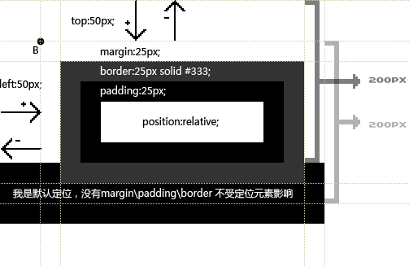
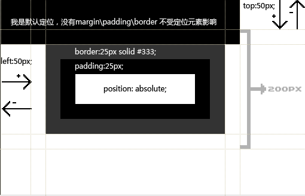
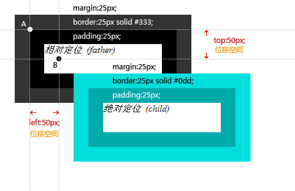

# 关于位置position的absolute和relative属性

今天在用别人写的class的时候位置有点不对劲，就查看了一下代码，发现是position的位置问题。

在搜索absolute和relative的时候发现一篇博文不错，记录并分享一下：

> # [详解定位与定位应用](http://blog.sina.com.cn/s/blog_4bcf4a5e010008o0.html)
>
> [盟牛的博客](http://blog.sina.com.cn/mnzj)

定位一直是WEB标准应用中的难点，如果理不清楚定位那么可能应实现的效果实现不了，实现了的效果可能会走样。如果理清了定位的原理，那定位会让网页实现的更加完美。

## 定位的定义：

在CSS中关于定位的内容是：

<!-- more -->

* position:relative | absolute | static | fixed
* static(静态) 没有特别的设定，遵循基本的定位规定，不能通过z-index进行层次分级。
* relative(相对定位) 对象不可层叠、不脱离文档流，参考自身静态位置通过 top,bottom,left,right 定位，并且可以通过z-index进行层次分级。
* absolute(绝对定位) 脱离文档流，通过 top,bottom,left,right 定位。选取其最近一个最有定位设置的父级对象进行绝对定位，如果对象的父级没有设置定位属性，absolute元素将以body坐标原点进行定位，可以通过z-index进行层次分级。
* fixed（固定定位） 这里所固定的参照对像是可视窗口而并非是body或是父级元素。可通过z-index进行层次分级。

*注：CSS中定位的层叠分级：z-index: auto | namber;*

*auto 遵从其父对象的定位*

*namber  无单位的整数值。可为负数*

## 定位的原理：

1. 可以位移的元素 （相对定位）

在本文流中，任何一个元素都被文本流所限制了自身的位置，但是通过CSS我们依然使得这些元素可以改变自己的位置，我们可以通过float来让元素浮动，也可以通过margin来让元素产生位置移动。但事实上那并非是真实的位移，因为，那只是通过加大margin值来实现的障眼法。而真正意义上的位移是通过top,right,bottom,left（下称TRBL，TRBL可以折分使用。）针对一个相对定位的元素所产生的。我们看下面的图：



我们看图中是一个相对定位的元素

```
#first {
width:200px;
height: 50px;
margin:25px;
border:25px solid #333;
padding:25px;
position:relative;
top: 50px;
left: 50px;
}
而下方是一块默认定位的黑色区块
#second {
width:400px;
height:75px;
margin:0;
border:0;
padding:0;
backgroud-color:#333;
}
```

我们看到这个处在文本流的区块被上面的相对定位挡住了一部分，这说明：“当元素被设置相对定位或是绝对定位后，将自动产生层叠，他们的层叠级别自然的高于文本流”。除非设置其z-index值为负值。并且我们发现当相对定位元素进行位移后，表现内容已经脱离了文本流，只是在本文流中还为原来的相对对定位留下了原有的总宽与总高（内容的高度或是宽度加上 margin\border\padding的数值）。这说明在相对定位中，虽然表现区脱离了原来的文本流，但是在文本流中还还有此相对定位的老窩。这点要特别注意，因为在实际应用中如果相对定位的位移数值过大，那么原有的区域就会形成一块空白。
    
并且我们注意，定位元素的坐标点是在margin值的左上边缘点，即图中的B点。那么所有的位移的计算将以这个点为基础进行元素的推动。

2. 可以在任意一个位置的元素（绝对定位）

如上所述：相对定位只可以在文本流中进行位置的上下左右的移动，同样存在一定的局限性，虽然他的表现区脱离了文本流，但是在文本流却依然为其保留了一席之地，这就好比一个打工的人他到了外地，但是在老家依然有一个专属于他的位置，这个位置不随他的移动而改变。但是这样很明显就会空出一块空白来，如果希望文本流抛弃这个部分就需要用到绝对定位。绝对定位不光脱离了文本流，而且在文本流中也不会给这个绝对定位元素留下专属空位。这就好比是一个工厂里的职位，如果有一个工人走了自然会要有别的工人来填充这个位置。而移动出去的部分自然也就成为了自由体。绝对定位将可以通过TRBL来设置元素，使之处在任何一个位置。在父层position属性为默认值时，TRBL的坐标原点以body的坐标原点为起始。看下图：



上图可知，文本流中的内容会顶替绝对定位无素的位置，一点都不会客气。而绝对定位元素自然的层叠于文本流之上。而在单一的绝对定位中，定位元素将会跑到网页的左上角，因为那里是他们的被绝对定位后的坐标原点。

3. 被关联的绝对定位

上面说的是单一的绝对定位，而在实际的应用中我们常常会需要用到一种特别的形式。即希望定位元素要有绝对定位的特性，但是又希望绝对定位的坐标原点可以固定在网页中的某一个点，当这个点被移动时绝对位定元素能保证相对于这个原坐标的相对位置。也就是说需要这个绝对定位要跟着网页移动，而并且是因定在网页的某一个固定位置。通常当网页是居中形式的时候这种效果就会显得特别的重要。要实现这种效果基本方式就是为这个绝对定位的父级设置为相对定位或是绝对定位。那么绝对定位的坐标就会以父级为坐标起始点。

虽然是如此，但是这个坐标原点却并不是父级的坐标原点，这是一个很奇怪的坐标位置。我们看一下模型图示：



我们看到，这个图中父级为黑灰色区块，子级为青色区块。父级是相对定位，子级是绝对定位。子级设置了顶部位移50个像素，左倾位移50个像素。那么我们看，子级的坐标原点并不是从父级的坐标原点位移50个像素，而是从父级块的padding左上边缘点为坐标起始点（即A 点）。而父级这里如果要产生位置移动，或是浏览器窗口大小有所变动都不会影响到这个绝对定位元素与父级的相对定位元素之间的位置关系。这个子级也不用调整数值。
这是一种很特别并且也是非常实用的应用方式。如果你之前对于定位的控制并不自如的话，相信看完对这里对定位的解释一定可以把定位使用得随心所欲。

4. 总在视线里的元素 （固定定位）

position:fixed; 他的含义就是：固定定位。这个固定与绝对定位很像，唯一不同的是绝对定位是被固定在网页中的某一个位置，而固定定位则是固定在浏览器的视框位置。