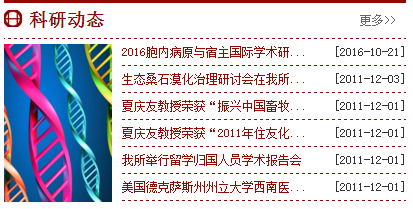

在做jeecms新闻网站开发的时候，遇到这么一个需求：首页需要在新闻旁边显示图片，新闻不添加标题图的时候显示默认图片，其中有新闻添加标题图时显示最近添加的一条新闻的标题图，如下图：


思路：用标签将所有的新闻标题图获取到js数组中，再用js进行控制显示最近的一张图片

用这种方法，当新闻数量很多的时候，就会有性能上的损失，页面加载会很卡。

由于jeecms是用java开发的，我便尝试用了break标签（文档上没有的），竟然可以用，这就可以用tags获取到有标题图的最近一条新闻了。

<!-- more -->

```
<script>
var kydttupian = "/${res}/images/14232842khlu.jpg"; //默认图片url

[@cms_content_list channelId="278701" orderBy='4' titLen='15' append='...' channelOption='1' dateFormat='yyyy-MM-dd'  ]
[#list tag_list as a]
	[#if a.titleImg?exists]
		kydttupian="${a.titleImg!site.defImg}";
		[#break]//遍历channel中所有的新闻，当新闻有标题图时，退出遍历
	[/#if]
[/#list]
[/@cms_content_list]

var ddd=document.getElementById("kydttp");
ddd.src=kydttupian;
</script>
```
